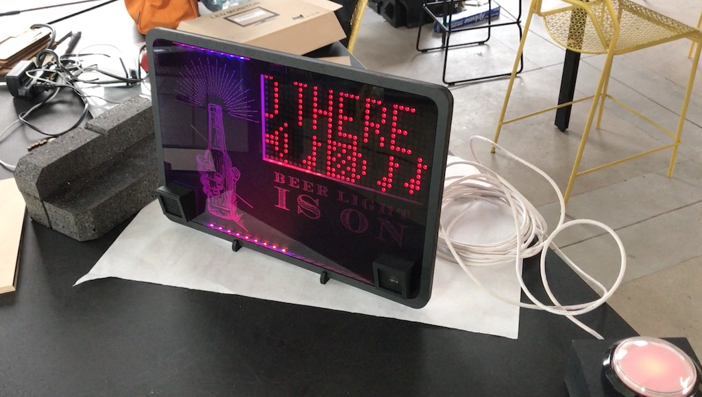
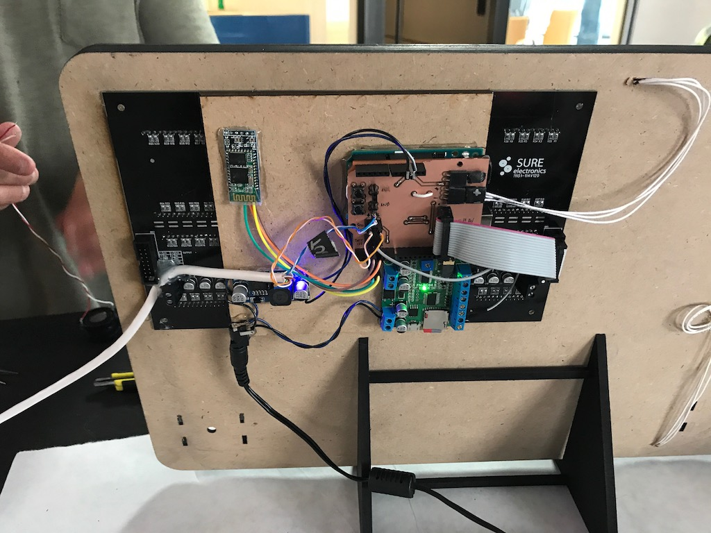
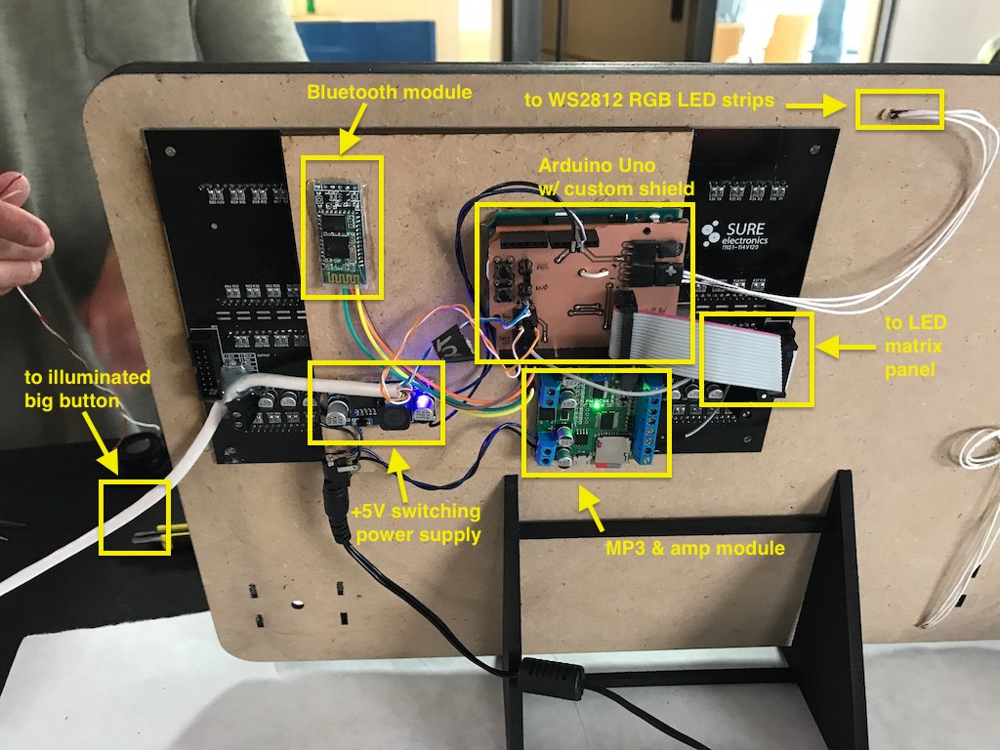

# SDLbeerlight

An overly complicated light for announcing a certain time of day (or state of mind)

It consists of:

- Arduino Uno running sketch in this repo
- Custom Arduino shield acting as breakout board for the following modules:
- An illuminated big button with integrated LED
- 24 WS2812 RGB LEDs
- Sure Electronics DE-DP14211 LED panel http://store3.sure-electronics.com/de-dp14211
- MP3 module with built-in 10W amp FN-BC04-TB -  https://electronics123.odoo.com/shop/product/fn-bc04-tb-4-buttons-triggered-mp3-player-board-with-10w-amplifier-and-terminal-blocks-8267 and two speakers
- LM2596 adjustable power supply module set to +5V output
- Custom-designed box and graphics by MotherFather Design

Dan, if you want to change things:
- The file "001.mp3" on the MP3 SD card is the sound that is played
- The trimpot on the MP3 board controls the sound volume
- The variable "msg" in the sketch sets the sign's default text message

